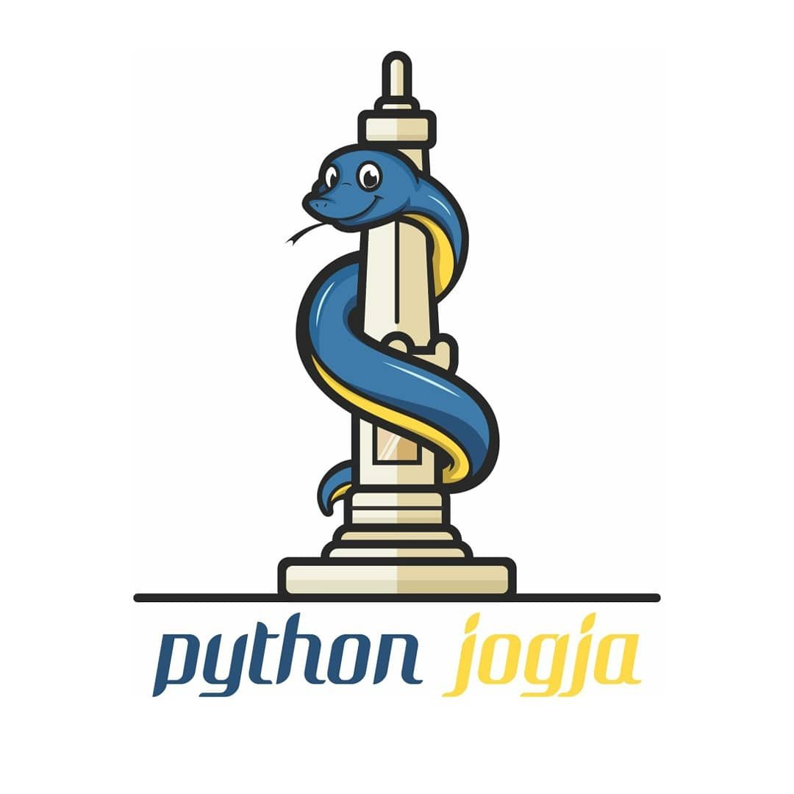
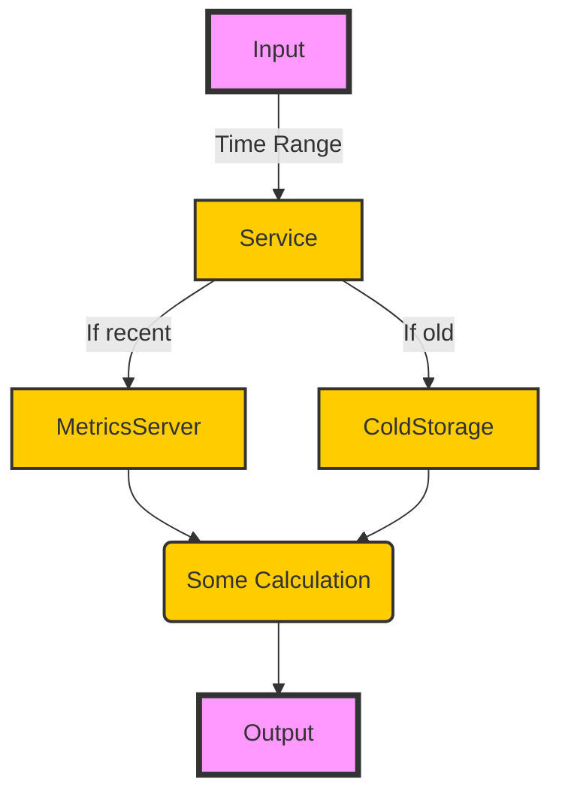

# Python Subtyping

Unraveling the Twin Tools of Protocol & ABC

<!--<div class="uppercase text-sm tracking-widest">
Novian Deny
</div>-->

<div class="abs-bl mx-14 my-12 flex">
  
  <div class="ml-3 flex flex-col text-left">
    <div>Python Jogja</div>
    <div class="text-xs opacity-50">Dec. 16th, 2023</div>
  </div>
</div>


---
layout: default
---

# Table of contents

<Toc maxDepth="1"></Toc>

---
transition: fade-out
---

# Background
Python Coding

Writing python is very fun

<v-click>

- It is fast to write

</v-click>
<v-click>

- Fast to run

</v-click>
<v-click>

- Fast to change

</v-click>


<v-click>

But maintaining it? Might be not so much fun.

</v-click>

<v-click>

```py
def process_records(records):
    result = {}
  
    for record in records:
        name, age, country = record
        if country not in result:
            result[country] = []
        result[country].append((name, age))
  
    return result
```

</v-click>

<!--
In the past, in one of my python project I don't use type hints or not using it too much
When the time comes that I need to do some changes, it can take me a while to understand what goes where and what is of what type, etc
-->

---
transition: fade-out
---

# Type Hints
PEP-0484 [^1]

```py {monaco-diff}
def process_records(records):
    result = {}
  
    for record in records:
        name, age, country = record
        if country not in result:
            result[country] = []
        result[country].append((name, age))
  
    return result
~~~
def process_records(records: List[Tuple[str, int, str]]) \
        -> Dict[str, List[Tuple[str, int]]]:
    result = {}
  
    for record in records:
        name, age, country = record
        if country not in result:
            result[country] = []
        result[country].append((name, age))
  
    return result


```


[^1]: [PEP-0484](https://peps.python.org/pep-0484/)

---
layout: two-cols
---

# The Project
Multpiple Data Source - Single Repository

- A simple service to collect metrics, do some calculation, and return it
- Multiple data source: hot & cold

::right::

<br>

---
layout: two-cols
transition: slide-up
level: 2
---

# First Approach
Naive Approach

```py
class MetricsServerRepository:
    @staticmethod
    def get_data(time_range: str) -> List[Dict]:
        return []

class ColdStorageRepository:
    @staticmethod
    def get_data(time_range: str) -> List[Dict]:
        return []

class MetricsService:
    def get_data(self, time_range: str) -> List[Dict]:
        if 'old' in time_range:
            data = ColdStorageRepository.get_data(time_range)
        else:
            data = MetricsServerRepository.get_data(time_range)
	
	return some_processing(data)
```

::right::

<v-click>

<br><br>
- `MetricsService` is directly dependent on specific repository classes
- If new criteria is added or repository is changed, we need to modify the MetricsService code

</v-click>

---

# Inspiration

Golang Interface

```go {all|1-3|5-12|14|17-18|20-21}
type MetricsRepository interface {
	Get(start_time int, end_time int) []Metrics
}

type coldStorageRepository struct{}
func (g *coldStorageRepository) Get(start_time int, end_time int) []Metrics

type metricsServerRepository struct{}
func (s *metricsServerRepository) Get(start_time int, end_time int) []Metrics

type databaseRepository struct{}
func (s *databaseRepository) GetUser(id int) []User

type Scraper struct { repo MetricsRepository } // TODO: change to func not struct

func main() {
	coldStorageRepo := Scraper{&coldStorageRepository{}}
	metricsServerRepo := Scraper{&metricsServerRepository{}}

	// ERROR: cannot use &databaseRepository{} as MetricsRepository
	databaseRepo := Scraper{&databaseRepository{}} 
}
```

<!--
Golang can infer that gcsRepository and s3Repository implements CloudStorageRepository interface while sqlRepository doesn't
-->

---
transition: fade-out
---

# Abstract Base Class (ABC)
PEP-3119 [^1]

- First introduced in PEP 3119 (Python 3.0) [^2]
- runtime check

[^1]: [ABC](https://docs.python.org/3/library/abc.html)
[^2]: [PEP-3119](https://peps.python.org/pep-3119/)

---
transition: fade-out
---

# Protocol
More Pythonic Way [^1]

[^1]: [PEP-0544](https://peps.python.org/pep-0544/)

---
transition: fade-out
---

# My Use Case

---
layout: center
class: text-center
---

# Learn More

[Documentations](https://sli.dev) · [GitHub](https://github.com/slidevjs/slidev) · [Showcases](https://sli.dev/showcases.html)
