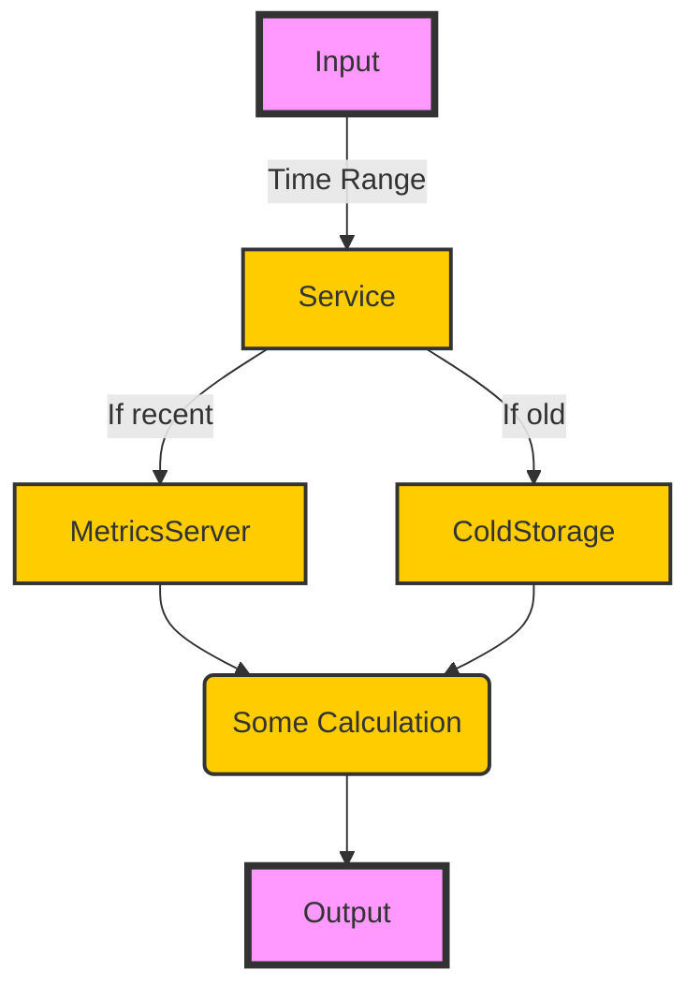

# Python Subtyping

Unraveling the Twin Tools of Protocol & ABC

<!--<div class="uppercase text-sm tracking-widest">
Novian Deny
</div>-->

<div class="abs-bl mx-14 my-12 flex">
  
  <div class="ml-3 flex flex-col text-left">
    <div>Python Jogja</div>
    <div class="text-xs opacity-50">Dec. 16th, 2023</div>
  </div>
</div>


---
layout: default
---

# Table of contents

<Toc maxDepth="1"></Toc>

---
transition: fade-out
---

# My Problems with Python
Dynamically typed

Writing python is very fun

<v-click>

- It is fast to write

</v-click>
<v-click>

- Fast to run

</v-click>
<v-click>

- Fast to change

</v-click>


<v-click>

But maintaining it? Might be not so much fun.

</v-click>

<v-click>

```py
def process_records(records):
    result = {}
  
    for record in records:
        name, age, country = record
        if country not in result:
            result[country] = []
        result[country].append((name, age))
  
    return result
```

</v-click>

<!--
In the past, in one of my python project I don't use type hints or not using it too much
When the time comes that I need to do some changes, it can take me a while to understand what goes where and what is of what type, etc
-->

---
transition: fade-out
---

# Type Hints
PEP-0484[^1]

```py {monaco-diff}
def process_records(records):
    result = {}
  
    for record in records:
        name, age, country = record
        if country not in result:
            result[country] = []
        result[country].append((name, age))
  
    return result
~~~
def process_records(records: List[Tuple[str, int, str]]) \
        -> Dict[str, List[Tuple[str, int]]]:
    result = {}
  
    for record in records:
        name, age, country = record
        if country not in result:
            result[country] = []
        result[country].append((name, age))
  
    return result


```


[^1]: [PEP-0484](https://peps.python.org/pep-0484/)

<style>
.footnotes-sep {
  @apply mt-20 opacity-10;
}
.footnotes {
  @apply text-sm opacity-75;
}
.footnote-backref {
  display: none;
}
</style>

---
layout: two-cols
---

# The Project
Multpiple Data Source - Single Repository

- A simple service to collect metrics, do some calculation, and return it
- Multiple data source: hot & cold

::right::

<br>


---

# Inspiration

Golang Interface

```go {all|1-3|5-12|14|16-18|20-21|22}
type MetricsRepository interface {
	Get(start_time int, end_time int) []Metrics
}

type coldStorageRepository struct{}
func (g *coldStorageRepository) Get(start_time int, end_time int) []Metrics

type metricsServerRepository struct{}
func (s *metricsServerRepository) Get(start_time int, end_time int) []Metrics

type databaseRepository struct{}
func (s *databaseRepository) GetUser(id int) []User

func scrapeMetrics(repo MetricsRepository, timeRange TimeRange)
func main() {
    coldStorageRepo := coldStorageRepository{}
    metricsServerRepo := metricsServerRepository{}
    databaseRepo := databaseRepository{} 

    scrapeMetrics(coldStorageRepo, timeRange); // OK
    scrapeMetrics(metricsServerRepo, timeRange); // OK
    scrapeMetrics(databaseRepo, timeRange); // ERROR: cannot use databaseRepository{} as MetricsRepository
}
```

<!--
Golang can infer that coldStorageRepo and metricsServerRepo implements CloudStorageRepository interface while sqlRepository doesn't
-->

---
layout: two-cols
transition: slide-up
level: 2
---

# First Approach
No special treatment

```py
class MetricsServerRepository:
    @staticmethod
    def get_data(time_range: TimeRange) -> List[Dict]:
        return []

class ColdStorageRepository:
    @staticmethod
    def get_data(time_range: TimeRange) -> List[Dict]:
        return []

class MetricsService:
    def get_data(self, time_range: TimeRange) -> List[Dict]:
        if time_range.is_old():
            data = ColdStorageRepository.get_data(time_range)
        else:
            data = MetricsServerRepository.get_data(time_range)
	
	return some_processing(data)
```

::right::

<v-click>

<br><br>

- <span style="color: lightgreen">Pretty intuitive & straightforward</span>

</v-click>

<v-click>

<br>

- <span style="color: salmon">`MetricsService` is directly dependent on specific repository classes</span>
- <span style="color: salmon">If new criteria is added or repository is changed, we need to modify the MetricsService code</span>

</v-click>

---
layout: two-cols
transition: fade
level: 2
---

# Abstract Base Class
PEP-3119 [^1]


```py {all|4-7,17-20|5-7|9,13|all}
from typing import List, Dict
from abc import ABC, abstractmethod

class Repository(ABC):
    @abstractmethod
    def get_data(self, time_range: TimeRange) -> List[Dict]:
        pass

class MetricsServerRepository(Repository):
    def get_data(self, time_range: TimeRange) -> List[Dict]:
        return [{'data': 'from metrics server'}]

class ColdStorageRepository(Repository):
    def get_data(self, time_range: TimeRange) -> List[Dict]:
        return [{'data': 'from cold storage'}]

class MetricsService:
    def get_data(self, repository: Repository, time_range: TimeRange) -> List[Dict]:
        data = repository.get_data(time_range)
        return data
```

::right::

<br><br>

- <span style="color: lightgreen">MetricsService is no longer directly dependent on specific repository classes</span>
- <span style="color: lightgreen">Clear and Enforced Contract: it is clear which methods a subclass should implement (nominal subtyping / explicit)</span>
- <span style="color: lightgreen">Error Detection: Python raises a `TypeError` at instantiation time</span>

<v-click>

<br>

- <span style="color: salmon">Inflexibility: To make a class behave as an ABC, it must explicitly inherit from the ABC</span>

</v-click>


[^1]: [ABC](https://docs.python.org/3/library/abc.html)

<style>
.footnotes-sep {
  @apply mt-20 opacity-10;
}
.footnotes {
  @apply text-sm opacity-75;
}
.footnote-backref {
  display: none;
}
</style>


---
layout: two-cols
transition: zoom
level: 2
---

# Protocol
PEP-0544 [^1]

```py {all|8-9,12-13|all}
from typing import Protocol

class RepositoryProtocol(Protocol):
    def get_data(self, time_range: TimeRange) -> List[Dict]:
        ...

class MetricsServerRepository(RepositoryProtocol):
    def get_data(self, time_range: TimeRange) -> List[Dict]:
        return [{'data': 'from metrics server'}]

class ColdStorageRepository(RepositoryProtocol):
    def get_data(self, time_range: TimeRange) -> List[Dict]:
        return [{'data': 'from cold storage'}]

class MetricsService:
    def get_data(self, repository: RepositoryProtocol, time_range: TimeRange) -> List[Dict]:
        data = repository.get_data(time_range)
        return data
```

::right::

<br><br>

- <span style="color: lightgreen">Flexibility: A class can satisfy a Protocol merely by providing the necessary methods or attributes, (structural subtyping / implicit)</span>
- <span style="color: lightgreen">Duck typing - "If it looks like a duck and quacks like a duck, then it's a duck"</span>
- <span style="color: lightgreen">Offers static type checking (and LSP's nice feature) without runtime overhead</span>

<v-click>
<br>

- <span style="color: salmon">Lack of early error detection - without a type-checker tool, incorrect implementation of a Protocol may run without errors until a problem happens at runtime</span>

</v-click>

[^1]: [PEP-0544](https://peps.python.org/pep-0544/)

<style>
.footnotes-sep {
  @apply mt-20 opacity-10;
}
.footnotes {
  @apply text-sm opacity-75;
}
.footnote-backref {
  display: none;
}
</style>


---
transition: fade-out
---

# ABC vs Protocol

|                     | **Abstract Base Classes**  | **Protocol**  |
|---------------------|----------------------------|---------------|
| **Typing**         | Nominal or Explicit        | Structural or Implicit  |
| **Flexibility**    | Less (Must explicitly inherit)| More (Only need to implement defined methods)  |
| **Error Detection**| Earlier (instantiation time)   | Later (mostly at runtime, or static-type checker)  |
| **Use Case**       | When the contract is more important | When you just care about some behaviors  |

<br>

- ABCs and Protocols streamline code and facilitate collaboration by setting clear expectations.
- Protocols offer valuable flexibility when you need a class to comply with multiple ABCs or only require certain behaviors, not full ABC

---
layout: center
class: text-center
---

# EOFError

Thanks for your time and attention! #HappyCoding
